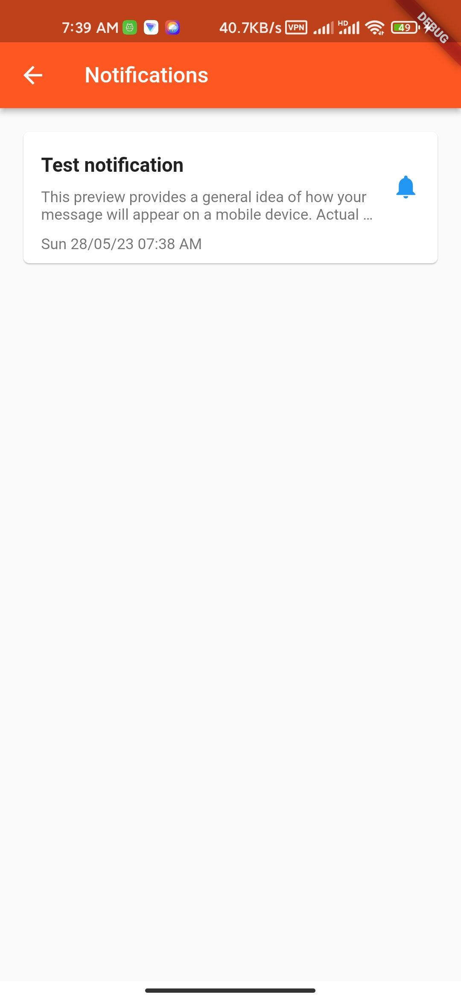
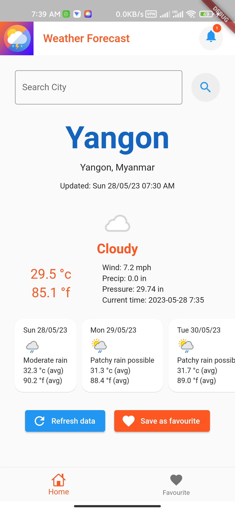
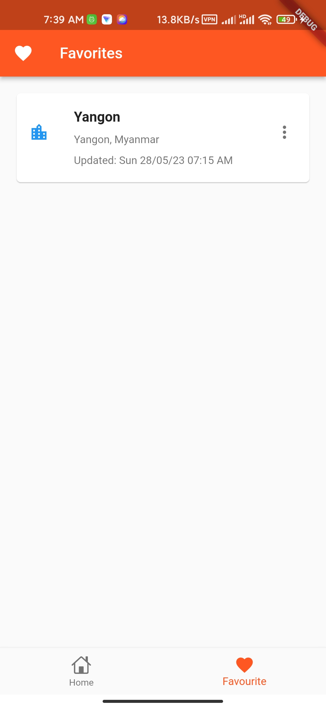

# weatherapp

Weather Forecast App

> Weather Forecast App using Flutter

## Demo APK

<a href="https://drive.google.com/file/d/1m17qTUVsbghGiTJkdQecHc95HW4U5dHa/view?usp=share_link" target="_blank">Download link</a>

## Screens

## 👨🏽‍💻 Tech Stack

| What?             | How?           |
| :---------------- | :------------- |
| State management  | Bloc / Cubit   |
| Api service       | Dio / Retrofit |
| Offline database  | Sqlite         |
| Push notification | Firebase       |

## ☑️ Features

- [ ] search weather information for a city
- [ ] a 3-day weather forecast
- [ ] favorite cities for offline access
- [ ] push notifications

## ✍️ Api

- Weather Api: <a href="https://www.weatherapi.com" target="_blank">weatherapi.com</a>
